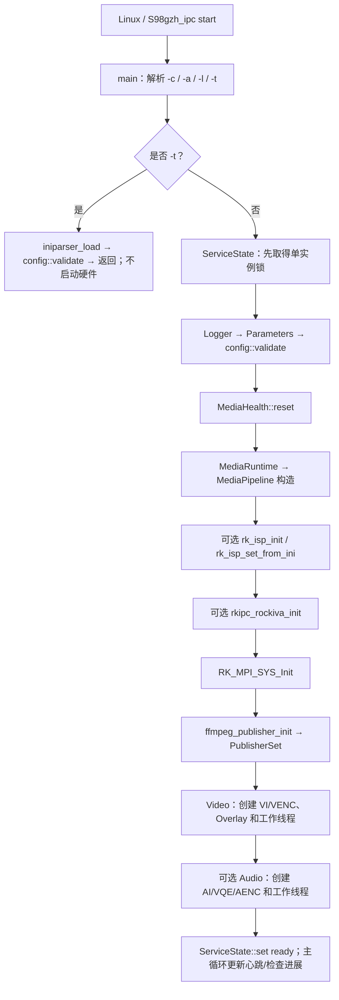
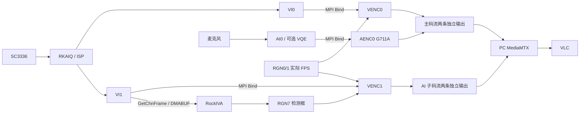
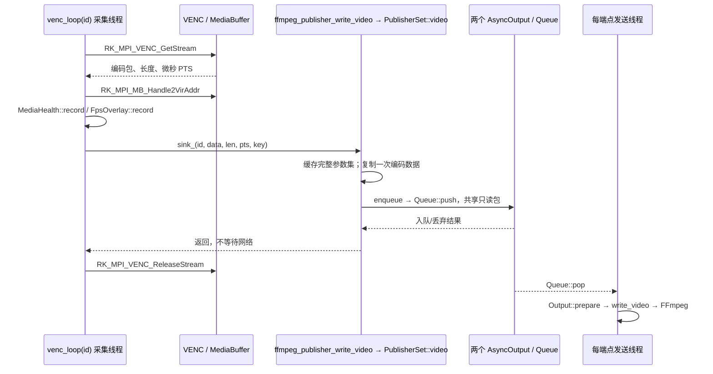
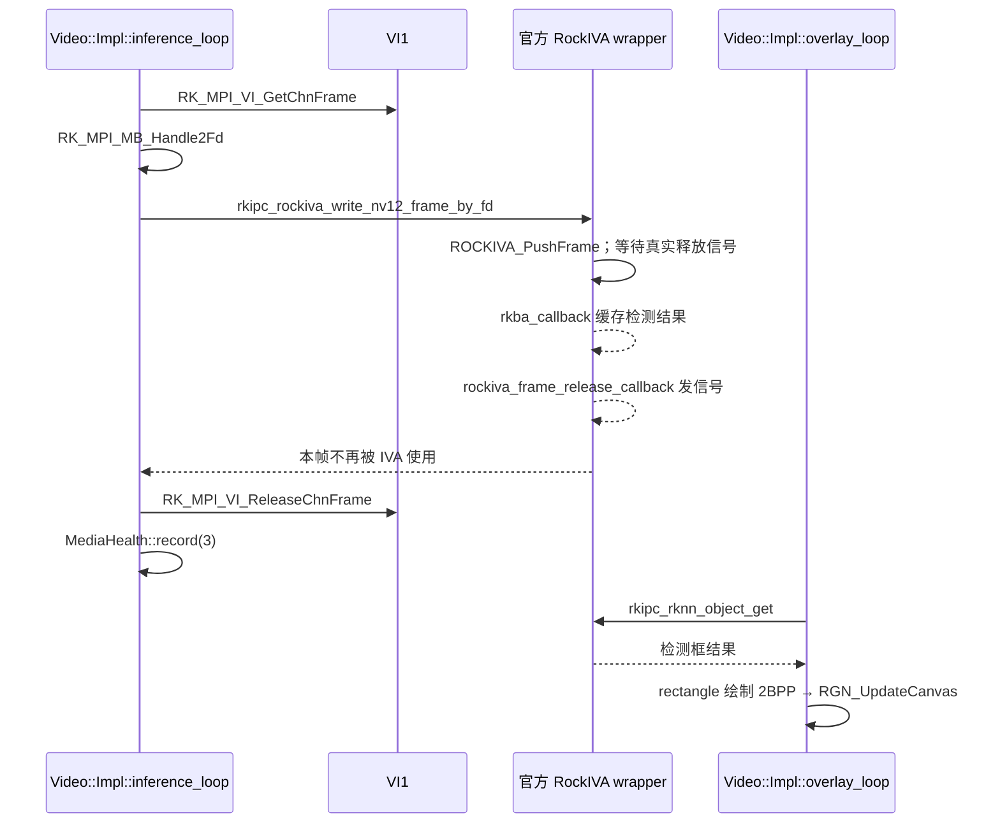
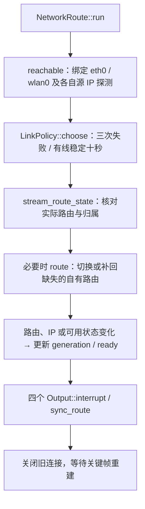
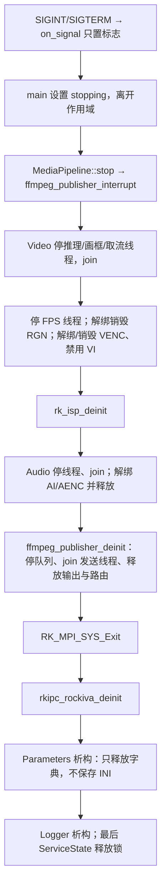

# RV1106 / SC3336 IPC：项目说明与代码阅读指南

面向 Rockchip RV1106、SC3336 摄像头的无屏网络摄像机程序，目标可执行文件为
`gzh_ipc`。自研部分使用 C++11，官方适配和日志端口使用 C，构建使用 CMake。
本文按当前仓库实现说明，适合先理解调用关系，再深入 SDK 的 C++ 初学者。

核心分工：**Rockchip 负责采集、ISP、编码与检测；FFmpeg 只封装和发送；
MediaMTX 接收并分发；VLC 是观看端。**

## 1. 项目目录与每个文件的作用

```text
rv1106ipc/
├── README.md                 项目入口、阅读指南、构建部署和验证说明
├── CMakeLists.txt            源码列表、头文件路径、交叉链接依赖
├── rv1106_sc3336.ini         默认媒体与网络配置
├── LICENSE                  项目许可证
├── .gitignore               排除构建产物、动态库、运行日志等
├── .gitattributes           统一源码与脚本使用 LF 换行
├── include/                 自研模块对外声明、日志配置与兼容头
├── src/                     自研实现和仅供内部使用的轻量头文件
├── common/                  官方公共代码的最小依赖集
│   ├── param/               dictionary → iniparser → rk_param 参数接口
│   ├── isp/rv1106/          RKAIQ / ISP 适配
│   ├── rockiva/             RockIVA 初始化、送帧、回调与结果缓存
│   └── easylogger/          EasyLogger 最小核心源码及原许可证
├── scripts/                 Buildroot 服务入口
├── tests/                   不需要摄像头的主机回归测试
└── build/                   本地 CMake 输出，不提交 Git
```

### 1.1 `include/`：告诉调用者“模块能做什么”

| 文件 | 作用 |
| --- | --- |
| [media.hpp](include/media.hpp) | 声明 `MediaRuntime`，用一个对象管理完整媒体系统，不暴露 SDK 结构体 |
| [ffmpeg_publisher.h](include/ffmpeg_publisher.h) | C 风格推流接口：初始化、视频/音频入队、中断与销毁 |
| [logger.hpp](include/logger.hpp) | 声明 `Logger`，管理 EasyLogger 生命周期和等级 |
| [log.h](include/log.h) | 将 `LOG_ERROR/WARN/INFO/DEBUG` 统一映射到 EasyLogger |
| [elog_cfg.h](include/elog_cfg.h) | EasyLogger 编译期配置：同步输出、行缓冲长度等 |
| [video.h](include/video.h) | 官方 ISP 包含的空兼容头；不是漏写的视频实现，不能随意删除 |

### 1.2 `src/`：实现“模块具体怎么做”

| 文件 | 主要对象/函数 | 作用 |
| --- | --- | --- |
| [main.cpp](src/main.cpp) | `main`、`Parameters`、`on_signal` | 命令行、配置加载与预检、对象装配、心跳、退出信号 |
| [media.cpp](src/media.cpp) | `MediaRuntime::MediaPipeline` | 按依赖组织 ISP、IVA、MPI、推流、视频和音频，统一失败回滚 |
| [media_channels.hpp](src/media_channels.hpp) | `Video`、`Audio`、`VideoSink`、`AudioSink` | 内部采集接口；通过函数指针注入输出，不依赖具体网络协议 |
| [media_support.hpp](src/media_support.hpp) | `require_ok`、`cleanup` | 初始化错误转换为异常；记录清理前后及返回码 |
| [video.cpp](src/video.cpp) | `Video::Impl` | VI/VENC、视频取流、IVA 旁路送帧、检测框与视频资源释放 |
| [audio.cpp](src/audio.cpp) | `Audio::Impl` | AI/VQE/AENC 初始化、G711A 取流及音频资源释放 |
| [ffmpeg_publisher.cpp](src/ffmpeg_publisher.cpp) | `PublisherSet`、`AsyncOutput`、`Output` | 编码包分发、独立发送线程、FFmpeg 封装、时间戳和重连 |
| [publisher_queue.hpp](src/publisher_queue.hpp) | `publishing::Packet`、`Queue` | 只读共享编码包、有界队列、丢弃过期 GOP、取消旧代数 IO |
| [annexb.hpp](src/annexb.hpp) / [annexb.cpp](src/annexb.cpp) | `ParameterSets`、`parameter_sets` | 声明/实现 H.264/H.265 参数集解析，不依赖 SDK 或 FFmpeg |
| [network_route.hpp](src/network_route.hpp) | `LinkPolicy`、`NetworkRoute` 声明 | 切换策略、网络可用状态和代数接口 |
| [network_route.cpp](src/network_route.cpp) | `reachable`、`route`、`run` | 绑定网卡探测、管理目标主机路由、检测源 IP 变化 |
| [route_identity.hpp](src/route_identity.hpp) | `owned_stream_route`、`stream_route_state` | 校验路由归属，区分自己的路由、路由缺失和外部冲突 |
| [fps_overlay.hpp](src/fps_overlay.hpp) / [fps_overlay.cpp](src/fps_overlay.cpp) | `FpsOverlay` | 原子计数实际视频帧数，约每秒更新两路 FPS 画布 |
| [fps_text.hpp](src/fps_text.hpp) | `fps_text::draw` | 小尺寸点阵字体与 2BPP 像素布局，不依赖外部字体库 |
| [service_state.hpp](src/service_state.hpp) | `ServiceState` | 独占 PID 文件锁，更新 starting/ready/stopping 和单调时钟心跳 |
| [media_health.hpp](src/media_health.hpp) | `MediaHealth` | 记录 VENC/AENC/IVA 的有效进展，检测连续无进展 |
| [config_validation.hpp](src/config_validation.hpp) | `config::validate` | 核心配置语义校验；不操作硬件、网络或写文件 |
| [logger.cpp](src/logger.cpp) | `Logger` | 初始化、过滤、停止 EasyLogger |
| [elog_port.c](src/elog_port.c) | `elog_port_*`、`prepare_log` | 线程安全日志端口、时间/线程信息、文件轮转和失败降级 |

### 1.3 `common/`：复用官方实现，而不是另写一套 SDK

| 文件 | 作用 |
| --- | --- |
| [common.h](common/common.h) / [common.c](common/common.c) | 官方公共声明和实现：信号量封装、时间、命令行和版本辅助函数 |
| [version.h](common/version.h) | 官方版本输出使用的兼容宏，不等同于本仓库 Git 提交版本 |
| [param/dictionary.h](common/param/dictionary.h) / [dictionary.c](common/param/dictionary.c) | 字符串键值字典的声明/存储实现 |
| [param/iniparser.h](common/param/iniparser.h) / [iniparser.c](common/param/iniparser.c) | INI 解析、读取和序列化；加载失败检查包含读取错误 |
| [param/param.h](common/param/param.h) / [param.c](common/param/param.c) | `rk_param_*` 包装、参数互斥锁、显式原子保存；退出不自动保存 |
| [isp/rv1106/isp.h](common/isp/rv1106/isp.h) / [isp.c](common/isp/rv1106/isp.c) | RKAIQ 初始化、应用 INI 图像参数和反初始化 |
| [rockiva/rockiva.h](common/rockiva/rockiva.h) / [rockiva.c](common/rockiva/rockiva.c) | 模型配置、送帧、检测/释放回调、检测结果缓存 |
| [rockiva/frame_wait.h](common/rockiva/frame_wait.h) | 等待真实帧释放通知，不能因信号等待超时就提前归还 VI 缓冲 |
| [easylogger/include/elog.h](common/easylogger/include/elog.h) | EasyLogger 对外声明 |
| [easylogger/src/elog.c](common/easylogger/src/elog.c) | 日志等级、过滤、格式化及输出调度 |
| [easylogger/src/elog_utils.c](common/easylogger/src/elog_utils.c) | EasyLogger 内部工具函数 |
| [easylogger/README.md](common/easylogger/README.md) | 上游来源、版本及裁剪范围说明 |
| [easylogger/LICENSE](common/easylogger/LICENSE) | EasyLogger 原 MIT 许可证，必须保留 |

### 1.4 服务和测试文件

[scripts/S98gzh_ipc](scripts/S98gzh_ipc) 是设备服务脚本，提供
`start/stop/restart/status`，内部 `_monitor` 用于有限自动恢复，不需要用户手工调用。

| 测试文件 | 检查什么 |
| --- | --- |
| [annexb_test.cpp](tests/annexb_test.cpp) | H.264/H.265 参数集解析 |
| [publisher_queue_test.cpp](tests/publisher_queue_test.cpp) | 队列容量、过期、关键帧恢复、停止唤醒及队列间隔离 |
| [network_fps_test.cpp](tests/network_fps_test.cpp) | 网络防抖策略和 FPS 2BPP 像素绘制 |
| [route_identity_test.cpp](tests/route_identity_test.cpp) | 路由归属、缺失、冲突和错误快照 |
| [media_health_test.cpp](tests/media_health_test.cpp) | 无进展超时、禁用通道及时间边界 |
| [service_state_test.cpp](tests/service_state_test.cpp) | 单实例锁和状态文件生命周期 |
| [service_test.sh](tests/service_test.sh) | 服务启停、错误 PID 保护、初始化超时 |
| [recovery_test.sh](tests/recovery_test.sh) | 人工停止不拉起、恢复退避、重试预算和熔断 |
| [frame_wait_test.c](tests/frame_wait_test.c) | IVA 等待超时/中断后仍等待真实释放通知 |
| [log_rotation_test.c](tests/log_rotation_test.c) | 应用日志大小、备份顺序、追加及失败降级 |
| [log_rotation_test.sh](tests/log_rotation_test.sh) | 恢复日志容量与失败停止写入 |
| [config_test.cpp](tests/config_test.cpp) | 参数校验、损坏文件保护、保存中途失败、退出不写盘 |

测试不是无用文件：它们保护之前修复的问题，且多数可以在 PC 上运行，不占用开发板摄像头。

## 2. 项目已具备的功能

| 功能 | 当前实现 | 重要边界 |
| --- | --- | --- |
| 双路视频 | VI0→VENC0、VI1→VENC1，H.264/H.265 可选 | 默认主流 1920×1080、子流 704×576，25 FPS |
| 主码流音频 | AI0→可选 VQE→AENC0，G711A | 8000 Hz、单声道；子码流没有音频 |
| 四路推流 | 两路 RTSP、两路 RTMP，独立上下文和发送线程 | FFmpeg 不重新编码；传统 FFmpeg 4.x FLV/RTMP 要求 H.264 |
| RockIVA 检测 | VI1 DMABUF 旁路推理，RGN7 在 VENC1 叠加检测框 | 模型外部部署；禁用 IVA 后子码流仍可发布 |
| 实际 FPS 显示 | 两路 VENC 取帧计数，RGN0/1 透明底白字 | 不是 VLC 接收帧率，也不是 IVA 推理帧率 |
| 单输出故障隔离 | 每 URL 独立有界队列和发送线程 | 同进程仍共享 CPU、内存、SDK、日志和物理网络 |
| 自动重连 | 参数集缓存、关键帧建连、失败后三秒退避 | 不是无缝播放；观看端可能需要重新播放 |
| 有线/Wi-Fi 切换 | 有线优先、防抖、稳定回切、路由修复和源 IP 变化检测 | 同网段单一 IPv4 接收端；不负责 Wi-Fi 配网 |
| 独立服务 | 单实例、启动预检、状态、正常停止和重启 | 保留系统必要驱动初始化，不等于可删除整个 RkLunch.sh |
| 故障检测与恢复 | 媒体进展/心跳检测，有限退避拉起和熔断 | 不强杀、不自动重启整板，不是硬件看门狗 |
| 日志容量管理 | 应用日志与恢复日志分别轮转 | 限容量不等于限写入量，也不能解除存储 I/O 阻塞 |
| 配置可靠性 | 硬件前预检、只读 `-t`、退出不写盘、显式原子保存 | 不包含热更新、自动出厂恢复或完整 ISP 参数校验 |

本项目没有增加 VO 显示、录像、Web 服务、数据库、ONVIF 或云平台；不要把它理解为
已经完成所有量产 IPC 功能及认证的产品。

## 3. 先认识几个容易混淆的概念

- **VI** 是视频输入，**VENC** 是视频编码，**AI0** 是 Audio Input（音频输入），
  不要把它与业务名称“AI 子码流”混淆；**AENC** 是音频编码。
- **构造函数**在创建对象时执行；**析构函数**在对象销毁时执行。RAII 让对象负责
  其资源的整个生命周期，失败时也能清理已取得的资源。
- `MediaRuntime::MediaPipeline` 是定义在类作用域内的实现类，**不是继承关系**。
  `MediaRuntime` 通过 `unique_ptr<MediaPipeline>` 拥有它。
- `Video::Impl` / `Audio::Impl` 是实现隐藏（PImpl）：头文件只暴露接口，SDK 类型留在 `.cpp`。
  `unique_ptr` 表示唯一拥有者；编码包的 `shared_ptr<const ...>` 允许两个端点共享只读副本。
- `VideoSink` / `AudioSink` 是函数指针。采集模块只调用回调，不需要知道 RTSP、RTMP 或 FFmpeg。
- `join()` 不是“要求线程停止”，而是**等待线程真正结束**；应先设置停止条件，再等待，再销毁通道。
- `extern "C"` 让 C++ 正确链接 C 接口；它不是“把这段代码变成另一个线程”。

下面流程图中的 SDK 调用名与业务类名对应当前源码。媒体数据流图表示数据路径；
时序图才表示调用、返回和跨线程边界。GitHub 可直接渲染 Mermaid 代码块。

## 4. 从启动到采集：谁调用谁，为什么调用

### 4.1 启动主线



为什么这样安排：

| 调用 | 原因 |
| --- | --- |
| `ServiceState` 先于日志、配置和硬件 | 防止重复启动的第二个程序触碰正在运行的资源 |
| `Parameters` → `rk_param_init` → `iniparser_load` | 只解析一次正式配置，供后续模块读取 |
| `config::validate(g_ini_d_)` 先于 `MediaRuntime` | 错误尺寸、编码或 URL 应在占用摄像头前失败 |
| `MediaHealth::reset` 先于工作线程 | 建立单调时钟起点，避免未初始化的超时判断 |
| `rk_isp_init` / 应用 IQ 与 INI | 为 SC3336 图像处理建立 RKAIQ 上下文 |
| `rkipc_rockiva_init` 先于推理线程 | 模型、句柄及释放回调必须先就绪 |
| `RK_MPI_SYS_Init` 先于通道调用 | VI/VENC/AI/AENC/RGN 都依赖 MPI 系统 |
| `ffmpeg_publisher_init` 先于采集线程 | 输出回调的接收对象必须已经存在 |
| `Video` / `Audio` 构造中创建线程 | 通道成功建立之后才开始 GetStream 循环 |

真正开始音视频工作的入口是 `MediaRuntime media(iq)`，它触发装配并启动线程。
之后 `main()` 不逐帧处理媒体，而是更新心跳、检查健康状态、等待退出信号。
`ready` 表示媒体初始化完成，**不表示 VLC 已有画面**。

### 4.2 硬件数据通路



INI 的 `video.2` 只是官方 RockIVA 封装读取输入尺寸的兼容段，不创建第三个 VI 通道。

## 5. 视频、音频如何进入推流队列

### 5.1 视频创建与取流

`Video::Impl` 构造调用 `init_device()`、两次 `create_vi()`、两次 `create_venc()`、
两次 `bind()`，随后创建可选检测框/FPS，再启动线程。
`create_venc()` 通过 `set_rate()` 和 `apply_quality()` 设置编码属性。

VI0 只供绑定编码使用，depth 为 0；启用 IVA 时 VI1 depth 为 1，允许旁路取帧。
`venc-main` 和 `venc-ai` 分别执行 `venc_loop(0/1)`。



复制的原因是硬件缓冲区在 `ReleaseStream` 后可以立即被复用。发送线程必须持有自己的
数据，而不能保存旧 MB 指针。两种协议共享这份只读副本，不是分别从硬件复制两次。

当前 SDK 的 `Handle2VirAddr` 已指向本次有效码流，代码**不再次加 `u32Offset`**。
之前错误叠加会导致越界/损坏 NAL 数据，与 `invalid body size` 等问题有关。
更换 SDK 时应核对官方 Demo 和实际缓冲含义，不把这个结论盲目套用于其他版本。

### 5.2 音频调用链

```text
Audio::Impl 构造
  → AI_SetPubAttr / AI_Enable
  → 可选 AI_SetVqeAttr / AI_EnableVqe
  → AI_EnableChn / 音量和声道设置
  → AENC_CreateChn → SYS_Bind(AI0, AENC0)
  → aenc-main 线程执行 loop()
      → AENC_GetStream → MB_Handle2VirAddr
      → sink_ → ffmpeg_publisher_write_audio → PublisherSet::audio
      → 主 RTSP / 主 RTMP 队列
      → AENC_ReleaseStream
```

底层声卡属性按官方配置使用双通道采集描述，发布音频仍为 8000 Hz 单声道 G711A。
VQE 处理帧长按 16 ms 计算，配置来自 `audio.0:vqe_cfg`。`AI0` 不是 RockIVA。

## 6. FFmpeg、同步、重连与故障隔离

### 6.1 三层对象分工

```text
PublisherSet：读取配置、选择输出、复制编码数据、缓存参数集
  ├── rtsp-main：AsyncOutput → Queue + worker + Output → AVFormatContext
  ├── rtmp-main：AsyncOutput → Queue + worker + Output → AVFormatContext
  ├── rtsp-ai：  AsyncOutput → Queue + worker + Output → AVFormatContext
  └── rtmp-ai：  AsyncOutput → Queue + worker + Output → AVFormatContext
```

`AsyncOutput::run()` 是该端点 FFmpeg 的唯一调用线程；主流音视频也由它串行处理，
不是两条采集线程直接争用一个 `AVFormatContext`。队列锁只保护内存操作，不包住网络发送。

| 函数 | 为什么调用 |
| --- | --- |
| `PublisherSet::setup_route` | 根据启用 URL 创建可选网络管理器，收集去重后的探测端口 |
| `PublisherSet::add` | 为每个启用端点创建独立 `AsyncOutput` |
| `PublisherSet::video/audio` | 复制一次编码数据，再分发到对应端点 |
| `Output::prepare` | 检查队列代数变化并应用参数集快照，旧 GOP 不再继续发送 |
| `Output::sync_route` | 网络代数变化时关闭旧连接，重新使用当前路由 |
| `Output::open` | 创建 AVFormatContext、AVStream 和编码参数，打开 IO 并写封装头 |
| `Output::write_packet` | 复制到 FFmpeg 自有 AVPacket、换算时间戳并调用 `av_interleaved_write_frame` |
| `Output::interrupt` | 根据退出标志、超时、队列代数、网络代数中断旧 IO |
| `Output::fail/close` | 记录错误并释放该端点上下文，不重启整条媒体管线 |

### 6.2 为什么关键帧还需要参数集

H.264 建连需要 SPS/PPS，H.265 还需要 VPS。`parameter_sets()` 从 Annex-B NAL 中提取
完整参数集；在采集分发侧缓存后，随包附带共享快照，避免队列丢弃首帧后无法重连。
首次从未取得完整参数集时继续等待；取得缓存后，后续关键帧不必再次携带参数集。

```mermaid
stateDiagram-v2
    [*] --> Waiting
    Waiting: 等待可用网络、关键帧和完整参数集缓存
    Waiting --> Opening: 条件满足且退避到期
    Opening: Output::open
    Opening --> Publishing: 写封装头成功
    Opening --> Backoff: 建连失败
    Publishing: 写视频及主流音频
    Publishing --> Backoff: 写包失败
    Backoff: 等待至少三秒
    Backoff --> Waiting: 等待下一关键帧
    Publishing --> Waiting: 网络或队列代数改变
```

FFmpeg 仅设置已有编码参数并复用编码包，不打开软件编码器重新编码。
传统 FFmpeg 4.x FLV/RTMP 不支持本项目的 H.265 推送，开启 RTMP 时两路视频须为 H.264。

### 6.3 音视频同步

每个端点**本次连接**首个视频关键帧的 VENC PTS 是时间原点：

```text
相对时间（微秒） = 当前 VENC/AENC PTS - 本连接首个视频关键帧 PTS
AVPacket 时间戳 = 将相对微秒换算为对应 AVStream 的 time_base
```

音视频使用同一硬件微秒时间轴；连接尚未建立、早于视频原点的音频被丢弃。
不同端点可能在不同关键帧恢复，因此不承诺四个上下文具有完全相同的连接原点。

### 6.4 队列有界，不用无限缓存掩盖慢连接

每端点队列上限是 **2 MiB、128 包、约一秒**；任一限制触发会丢弃积压 GOP、增加队列
代数，使旧 IO 取消，并等待下一视频关键帧。单个视频包超过 2 MiB 同样会被丢弃。
参数集缓存独立保留，音频只分发到主流队列。

这些限制不包含在途包、FFmpeg 和 socket 内部缓存。返回“入队成功”不等于服务器已收到。
四路共用网卡、内存、日志和进程，故这不是进程级故障隔离，也无法强行终止卡在 SDK 内的线程。

## 7. RockIVA 检测框与 FPS 如何出现在画面上

### 7.1 RockIVA 调用与释放



检测回调与帧释放回调由 SDK 异步触发，不保证总按图中展示的先后发生；唯一必须遵守的
资源约束是：**收到真实释放通知后才能归还 VI 帧**。`frame_wait.h` 对超时/中断继续等待，
不以提前释放制造悬空 DMABUF。若 SDK 永不回调，正常退出可能卡住，服务会熔断而非强杀。

检测框通过 RGN7 绑定 VENC1，在编码画面中叠加，因此两种协议的子流都能看到。
`video.source:npu_fps` 控制送推理频率；`video.2` 尺寸必须与子流一致。
模型来自外部 SDK，默认 `rockiva:model_path=/usr/lib/`，不提交模型到仓库。

### 7.2 FPS 不是写死的 INI 数值

`venc_loop()` 成功取得有效编码帧时调用 `FpsOverlay::record(id)`。
`FpsOverlay::run()` 约每秒取出计数，计算“帧数 / 实际经过秒数”，再调用 `update()`：

```text
GetCanvasInfo → fps_text::draw → RK_MPI_RGN_UpdateCanvas
```

RGN0/1 各绑定一路 VENC，画布 128×32，位置 (16,16)，字形约 10×14 像素，白字透明底。
2BPP 按当前设备验证的高位在左绘制。VENC 上叠加后，RTSP 和 RTMP 均包含该文字。
它衡量编码取流进展，不是接收端丢包后的 FPS，也不是检测次数；初始积压会影响首个统计窗口。

## 8. 有线/Wi-Fi 切换怎样与四路推流协作



- `network:enable_failover=1` 时有线优先；有线连续三轮失败且 Wi-Fi 可达时切换。
  有线连续健康至少十秒后回切；Wi-Fi 连续三轮失败且有线可达时也回切。
- 探测使用所有启用 URL 中去重的端口，任一建连成功或明确拒绝连接都表示网络可达。
  **服务端关闭不必然代表网卡故障**。每接口约 700 ms 等待预算，之后每轮等待一秒，
  所以三轮失败不等于恰好三秒。
- 两路都不可达时保留选择，达到失败门限后暂停发布，不反复改路由；恢复时更新代数并重连。
- 周期核对 `/proc/net/route`，修复被系统删除的自有路由；检测同接口源 IP 变化。
  路由操作失败重试间隔至少三秒，外部冲突告警最多每三十秒一次。
- 只管理接收端的直连 `/32`，metric 4270。启动可接管 `/run/gzh_ipc.route` 精确匹配的旧记录；
  运行中发现外部冲突会暂停发布，退出前再次核对归属，不覆盖其他主机路由。
- 要求启用的 URL 指向同一个、与两块接口同网段的 IPv4 接收端，需要 root 权限。
  不配置 SSID、DHCP、默认网关，不支持此模块自动处理跨网关或域名切换。
- 此 `/32` 是系统路由，**也影响设备到同一 PC 的 SSH 等其他流量**，不是只对本进程生效。
  不要让其他程序同时管理它；路由读取与 ioctl 之间仍存在外部并发修改窗口。

设备已实测拔线切到 Wi-Fi、恢复后回切，四个端点重新发布且进程未重启。
但 MediaMTX 替换发布源时可能终止旧观看连接，本次 VLC 测试需要手动重新播放。
**设备重推成功不等于 VLC 自动续播；本项目不承诺无缝切换。**

## 9. 服务、健康检测与正常退出

### 9.1 服务命令和自动恢复

```sh
/etc/init.d/S98gzh_ipc start
/etc/init.d/S98gzh_ipc status
/etc/init.d/S98gzh_ipc stop
/etc/init.d/S98gzh_ipc restart
```

Buildroot 的标准 rcS/rcK 集成会在启动/关机时调用服务脚本；实际系统应确认启动链启用了
这些脚本。用户也可手工执行。`restart` 必须先正常停止成功才启动，不同时创建两份 IPC。

| 状态/故障 | 实现 |
| --- | --- |
| 启动 | 检查文件、库、官方 rkipc 冲突，执行 `-t`；等待驱动和媒体 ready |
| 人工 stop | 先写恢复意图 off，再发 SIGTERM；最多等待 30 秒，不自动拉起 |
| 媒体无进展 | VENC0/1 或启用的 AENC/IVA 连续 60 秒无进展，主线程请求正常退出 |
| 心跳/初始化异常 | 监控每五秒检查；按状态和超时请求 SIGTERM |
| 进程意外退出 | 10/20/30 秒退避，最多三次自动启动 |
| 恢复预算重置 | 连续 ready 且心跳健康五分钟，而非刚启动就清零 |
| 停止失败/冲突/次数耗尽 | 意图变成 blocked，保留现场，不 SIGKILL、不重启整板 |

`ServiceState::set()` 每秒写 `/run/gzh_ipc.pid`，格式为
`PID starting|ready|stopping monotonic_seconds`；`MediaHealth::record()` 更新原子时间戳。
健康依据是采集/处理进展，不是识别到目标、画面质量或 VLC 播放成功。

`/run/gzh_ipc.desired` 保存恢复意图；`service.lock` 串行启停，`watchdog.lock` 保证唯一监控。
人工 stop 后监控进程可以继续存在，但不会拉起 IPC。监控自身退出不会自动自救，显式 start 可恢复。
不要手工删除运行中的 PID/锁文件，也不要绕过停止超时去循环强制 restart。

### 9.2 严格按当前代码解释退出顺序



这里不能机械理解成“每个 SDK 调用都完全倒放初始化顺序”：顶层媒体顺序与当前官方
RV1106 退出方式对齐；对象内部按依赖停止使用者，再释放资源。先中断网络，是为了帮助
发送线程结束；先等取流线程，是为了避免销毁它还在使用的 MPI 通道。
构造中途失败同样清理已成功创建的资源，具体完成情况记录在 `shutdown:` 日志。

## 10. 配置可靠性与日志容量

### 10.1 INI 的入口及常用字段

`[stream]` 下的 `rtsp_main_url`，在代码中写成 `stream:rtsp_main_url`。
不要把推流 URL 放进 `[network]`。

| 配置段 | 用途 |
| --- | --- |
| `stream` | 两种协议开关、四个 URL、RTSP transport、IO 超时 |
| `network` | 有线/Wi-Fi 切换开关 |
| `video.source` | ISP、IVA 开关与推理频率；无 VO 显示 |
| `video.0` / `video.1` | 两路尺寸、编码、帧率、GOP、码率和缓冲 |
| `video.2` | 官方 IVA 兼容输入尺寸，不是第三路编码 |
| `audio.0` | G711A、声卡、采样、音量、VQE 及 JSON 路径 |
| `rockiva` / `event.regional_invasion` | 模型目录、模型类型和检测区域参数 |
| `osd` / `osd.common` | FPS 开关、官方区域配置的归一化尺寸 |
| `isp` / `isp.0.*` | 图像场景、曝光、白平衡、增强和其他官方 ISP 参数 |
| `log` | 等级 0 错误、1 警告、2 信息、3 调试 |

```sh
export LD_LIBRARY_PATH=/root/gzh_ipc_lib:/oem/usr/lib:/usr/lib:/lib
/root/gzh_ipc -t -c /oem/usr/share/rv1106_sc3336.ini
```

`-t` 只解析和检查核心参数，不创建 Logger/ServiceState、不启动硬件或网络、不写配置；
可在已有服务运行时使用。返回 0 表示该预检通过，非零表示失败。
检查包括开关、URL、同一 IPv4、H.264/RTMP 兼容性、偶数尺寸、帧率、码率和 IVA 尺寸等。
整数不允许模糊前导零，避免官方 base=0 解析器按八进制解释。

未检查完整 ISP 语义、SDK 支持范围、IQ/模型/VQE 内容或服务器连通性；也不保证发现
所有重复键、缺失可选项和语法仍合法的截断文件。语义错误只报键；解析语法错误可能回显
原始行，分享日志前仍需脱敏。

加载失败不再执行 shell 复制出厂文件，损坏原文件保持原样。程序退出也不自动重写 INI，
保留注释并减少退出写盘。官方 ISP 的 set 操作可修改内存字典，但不隐式永久保存。

显式 `rk_param_save()` 的流程是：

```text
持有参数锁 → 检查现有普通文件 → 同目录 mkstemp
→ dump_ini → 检查写入 / fflush / fsync
→ rename 原子替换 → fsync 父目录 → 释放锁
```

重命名前失败保留原文件和字典；目录同步失败时新文件可能已经可见，但不能承诺断电持久。
保存会重新序列化，不保留注释；拒绝符号链接。`rk_param_reload()` 解析失败保留旧字典，
它不是可在线调用的热更新接口，不能在其他线程持有配置字符串指针时使用。
没有自动备份/回滚配置功能，维护前应保留已知可用副本，先对候选文件预检再替换。

### 10.2 日志输出和轮转

```text
LOG_INFO/WARN/ERROR → EasyLogger → elog_port_output
                                  ├── stderr
                                  └── /root/rkipc.log（写入前轮转）
服务监控 recovery_log ───────────────→ /root/gzh_ipc-recovery.log（独立轮转）
```

| 文件 | 限制 |
| --- | --- |
| `/root/rkipc.log` | 当前文件最大 1 MiB；保留 `.1` 较新、`.2` 较旧，共约 3 MiB |
| `/root/gzh_ipc-recovery.log` | 每份最大 256 KiB，保留 `.1`，共约 512 KiB |

写入前重命名轮转，不复制、不压缩、不调用 sync/fsync；最旧备份被覆盖后不可恢复。
升级前的超大日志会先保留为备份，随后轮转淘汰，初期总量可能超过限制。
文件写入或轮转失败后，该进程停止文件日志尝试；应用仍输出 stderr。
启动时连日志文件都无法打开，则仍报初始化失败。

轮转不接管 SDK 直接 printf、内核日志、core 文件或手动终端重定向。不要再把 stderr
重定向回同一个 rkipc.log，也不要让外部工具并发轮转该文件。同步日志仍可能受底层 I/O
阻塞影响，容量限制不是存储故障隔离。

## 11. 交叉编译和外部依赖

项目已在用户提供的 RV1106 SDK 环境交叉编译并部署；不下载或编译完整 SDK。
所有外部头文件与库必须来自相匹配的目标 ABI，不能链接 PC 的 x86 库。

| CMake 链接项 | 用途 |
| --- | --- |
| `rockit`、`rockchip_mpp` | MPI 和媒体编解码底层 |
| `rkaiq` | ISP / IQ |
| `rockiva`、`rknnmrt`、`rga` | IVA、NPU 与图像处理依赖 |
| `rksysutils` | GPIO/PWM 等官方适配工具 |
| `rkaudio_detect`、`aec_bf_process`、`rkaudio` | 官方音频处理/VQE 依赖 |
| `avformat`、`avcodec`、`avutil` | 封装、协议、编码参数和 FFmpeg 基础支持 |
| `pthread`、`m` | 线程和数学库 |

EasyLogger 核心直接由 `common/easylogger` 编译，不需要单独下载库。
CMake 设置 `ISP_HW_V32`，检查关键 SDK/FFmpeg 头文件，并通过 `-rpath-link` 帮助链接器解析依赖。
`SKIP_BUILD_RPATH=YES`：不能把构建时搜索路径当成板端库路径，服务使用 `LD_LIBRARY_PATH`。

以下路径是占位符，应替换为自己机器上的实际路径。`-S/-B` 形式需支持该选项的 CMake；
项目文件声明的最低版本为 3.5，旧版可在 build 目录使用 `cmake ..`。

```sh
cmake -S . -B build \
  -DCMAKE_TOOLCHAIN_FILE=/path/to/rv1106-toolchain.cmake \
  -DCMAKE_BUILD_TYPE=Release \
  -DROCKCHIP_SDK_ROOT=/path/to/rv1106/staging \
  -DFFMPEG_ROOT=/path/to/ffmpeg-target \
  -DROCKCHIP_INCLUDE_DIR=/path/to/sdk/include \
  -DROCKCHIP_SYSUTILS_INCLUDE_DIR=/path/to/sysutils/include \
  -DROCKCHIP_LIB_DIR=/path/to/sdk/lib
cmake --build build -- -j2
git diff --check
```

本仓库不附带通用工具链文件；使用匹配自己 SDK 的文件。默认 include/lib 布局匹配
`ROCKCHIP_SDK_ROOT/usr` 时，可以省略最后三个路径覆盖参数。
`cmake --install` 的通用 bin/share 布局不等于下面的设备部署布局，不要直接假设自动安装到 `/root/`。

## 12. 部署、运行与 VLC 地址

### 12.1 设备文件布局

| 设备路径 | 内容 |
| --- | --- |
| `/root/gzh_ipc` | 程序；不要部署到 `/oem/usr/bin/` |
| `/etc/init.d/S98gzh_ipc` | 服务脚本，权限 755 |
| `/oem/usr/share/rv1106_sc3336.ini` | INI |
| `/root/gzh_ipc_lib/` | 设备缺少的、与 SDK 匹配的私有动态库 |
| `/etc/iqfiles/` | 匹配 SC3336 的 IQ 文件目录 |
| `/usr/lib/` 或 `rockiva:model_path` | 官方模型；默认 PFP 模型常用 `object_detection_pfp.data` |
| `/oem/usr/share/vqefiles/config_aivqe.json` | 当前默认 VQE 配置，名称以 INI 实际值为准 |
| `/run/gzh_ipc.*` | PID、意图、锁和路由归属；临时状态，不提交仓库 |

启停前确认官方 `rkipc` 不占摄像头。保留 S21appinit/RkLunch.sh 必要驱动与网络初始化，
仅禁用官方 rkipc 的自动启动，不能直接删除整个脚本。

更新步骤：上传暂存文件 → 配置预检与校验值比对 → 在 `/root/` 下保留旧版本
→ 正常 stop → 替换程序/必要脚本 → start → 核对 ready、publishing 和实际画面。
不要覆盖正在运行的程序，也不要把 `S98gzh_ipc.bak` 放在 `/etc/init.d/`，它可能再次被当作启动项。
服务脚本更新后，已运行的旧监控也须在维护窗口更新，不能只替换文件就认为后台逻辑已更新。

服务固定搜索：`/root/gzh_ipc_lib:/oem/usr/lib:/usr/lib:/lib`。
缺库时核对 ABI、SONAME 和间接依赖，不要用任意版本软链接伪造兼容性。
无新增库依赖的代码更新不需要反复覆盖板端动态库。

前台排障应先停止服务，不能同时运行第二个 IPC：

```sh
export LD_LIBRARY_PATH=/root/gzh_ipc_lib:/oem/usr/lib:/usr/lib:/lib
/root/gzh_ipc -h
/root/gzh_ipc -t -c /oem/usr/share/rv1106_sc3336.ini
# 前台运行前先正常停止服务；Ctrl+C 请求正常释放资源。
/root/gzh_ipc -c /oem/usr/share/rv1106_sc3336.ini -a /etc/iqfiles -l 2
```

### 12.2 观看地址

当前 INI 的 MediaMTX PC 地址为 `192.168.0.101`；设备有线示例为 `.103`，Wi-Fi 为 `.105`。
VLC 打开的是 **PC 上的接收地址，不是设备 IP**：

| 地址 | 内容 |
| --- | --- |
| `rtsp://192.168.0.101:8554/main_rtsp` | 主视频与 G711A 音频 |
| `rtsp://192.168.0.101:8554/ai_rtsp` | 子视频、可选检测框，无音频 |
| `rtmp://192.168.0.101:1935/main_rtmp` | 主视频与音频 |
| `rtmp://192.168.0.101:1935/ai_rtmp` | 子视频、可选检测框，无音频 |

在 VLC 选择“媒体 → 打开网络串流”并输入地址。PC 应先启动 MediaMTX 并允许相应端口访问。
四个路径保持不同，避免多个发布者争用同一路径。换 PC 时修改 INI 中四个 URL。
网络切换后如果观看会话被服务器关闭，VLC 可能需要重新播放；先看发布与观看两端日志区分原因。

## 13. 验证方法和已知边界

### 13.1 主机回归

从仓库根目录执行。下面只在 PC 临时目录生成测试程序，不连接开发板：

```sh
sh -n scripts/S98gzh_ipc
sh tests/service_test.sh
sh tests/recovery_test.sh
sh tests/log_rotation_test.sh

g++ -std=c++11 -Wall -Wextra -pthread -Isrc \
  tests/publisher_queue_test.cpp -o /tmp/gzh-queue-test
/tmp/gzh-queue-test
g++ -std=c++11 -Wall -Wextra -pthread -Isrc \
  tests/network_fps_test.cpp -o /tmp/gzh-network-test
/tmp/gzh-network-test
g++ -std=c++11 -Wall -Wextra -Isrc \
  tests/route_identity_test.cpp -o /tmp/gzh-route-test
/tmp/gzh-route-test
g++ -std=c++11 -Wall -Wextra -Isrc \
  tests/annexb_test.cpp src/annexb.cpp -o /tmp/gzh-annexb-test
/tmp/gzh-annexb-test
gcc -std=gnu99 tests/frame_wait_test.c -o /tmp/gzh-frame-test
/tmp/gzh-frame-test
git diff --check
```

可为 C/C++ 测试添加 `-fsanitize=address,undefined -fno-omit-frame-pointer` 检查越界/未定义行为。
配置测试还需链接 `common/param`、EasyLogger 核心及 `src/elog_port.c`，C 文件使用 C 编译器，
再用 C++ 编译器与 `tests/config_test.cpp` 链接；它通过临时目录和子进程文件大小限制模拟保存失败。
主机测试只证明相应逻辑，不替代 SDK 和板端验证。

### 13.2 板端验收与故障定位

```sh
/etc/init.d/S98gzh_ipc status
tail -n 80 /root/rkipc.log
tail -n 30 /root/gzh_ipc-recovery.log
cat /run/gzh_ipc.route
netstat -nt
dmesg | tail -80
```

| 现象 | 优先检查 |
| --- | --- |
| 库 not found | 服务 LD_LIBRARY_PATH、库架构/SONAME、间接依赖 |
| 配置错误退出 | 对实际 INI 运行 `-t`，核对报错键；不要覆盖原文件 |
| 摄像头初始化失败 | 是否已有 rkipc、IQ/传感器/驱动节点和 SDK 返回值 |
| RTMP invalid body size | 编码包地址/长度、参数集、SDK 的 offset 语义和 MediaMTX 日志 |
| RTP packets too big / remuxing | 服务器重新分包提示；结合后续错误判断，不单凭此行认定推流失败 |
| 切网后 VLC 停止 | 分别检查设备重新 publishing、服务器发布源替换和观看连接 terminated |
| AI 没框 | enable_npu、模型/区域配置、检测结果与 RGN；视频正常不代表一定检测到目标 |
| stop 超时 | 最后一个 shutdown 阶段、IVA 释放回调、SDK 阻塞；不要强杀掩盖现场 |
| EXT4 / eMMC 错误、USB 同时失联 | 存储、供电及内核/驱动诊断，不当作普通网络故障 |

已完成的设备观察包括四路正常发布、人工停止不自动拉起、异常退出后的有限恢复、日志轮转、
配置预检，以及手工拔线切 Wi-Fi 和恢复有线后的重新发布。
单输出故障注入、改 IP/路由异常恢复、长期稳定性及全部冷启动组合仍需按维护窗口继续验收。

历史曾出现 eMMC 写失败、EXT4 日志中止和设备失联。当前功能优化不能证明该底层问题已解决。
不要通过拔电、Reset、SIGKILL、反复强制刷盘或在线文件系统修复制造测试；需要时先准备独立串口采证。

## 14. 初学者的推荐阅读路线

1. 先看第 1 节文件职责，再看第 4 节启动流程，理解 `main()` 不直接逐帧发送。
2. 打开 `include/media.hpp` 和 `src/media.cpp`，看对象拥有关系，**不要把嵌套类当继承**。
3. 沿第 5 节跟踪一帧：GetStream → 回调复制 → 入队 → ReleaseStream → 发送线程。
4. 再读 `PublisherSet` → `AsyncOutput` → `Output`，区分分发、调度与协议封装。
5. 最后看 IVA 回调、网络代数、服务恢复和第 9 节退出顺序。

读任何函数时都问：**谁调用它？在哪个线程？输入由谁拥有？为何要此时调用？
失败由谁处理？资源最终在哪里释放？** 这些问题比先背 SDK 结构体更能帮助理解整个项目。

修改后保留已有中文/Doxygen 注释，优先核对本地 SDK 头文件和官方 Demo，不猜 API；
只改需求相关位置，补相应主机测试，运行 `git diff --check`，再根据真实板端日志验证。
SDK、模型、IQ、第三方目标库、运行日志和设备凭据都不应提交到仓库。
